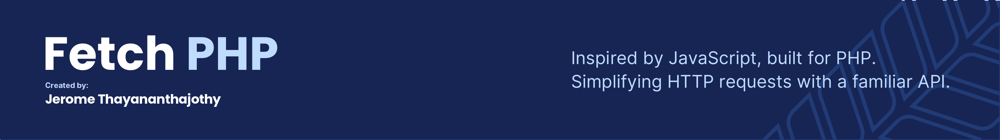

[](https://github.com/Thavarshan/fetch-php)

# Fetch PHP

[](https://packagist.org/packages/jerome/fetch-php)
[](https://github.com/Thavarshan/fetch-php/actions/workflows/run-tests.yml)
[](https://github.com/Thavarshan/fetch-php/actions/workflows/laravel-pint.yml)
[](https://packagist.org/packages/jerome/fetch-php)

**Fetch PHP** is a modern HTTP client library for PHP that brings JavaScript's `fetch` API experience to PHP. Built on top of Guzzle, Fetch PHP allows you to write HTTP code with a clean, intuitive JavaScript-like syntax while still maintaining PHP's familiar patterns.

With support for both synchronous and asynchronous requests, a fluent chainable API, and powerful retry mechanics, Fetch PHP streamlines HTTP operations in your PHP applications.

Full documentation can be found [here](https://fetch-php.thavarshan.com/)

---

## Key Features

- **JavaScript-like Syntax**: Write HTTP requests just like you would in JavaScript with the `fetch()` function
- **Promise-based API**: Use familiar `.then()`, `.catch()`, and `.finally()` methods for async operations
- **Fluent Interface**: Build requests with a clean, chainable API
- **Built on Guzzle**: Benefit from Guzzle's robust functionality with a more elegant API
- **Retry Mechanics**: Automatically retry failed requests with exponential backoff
- **PHP-style Helper Functions**: Includes traditional PHP function helpers (`get()`, `post()`, etc.) for those who prefer that style

## Why Choose Fetch PHP?

### Beyond Guzzle

While Guzzle is a powerful HTTP client, Fetch PHP enhances the experience by providing:

- **JavaScript-like API**: Enjoy the familiar `fetch()` API from JavaScript
- **Global client management**: Configure once, use everywhere with the global client
- **Simplified requests**: Make common HTTP requests with less code
- **Enhanced error handling**: Reliable retry mechanics and clear error information
- **Type-safe enums**: Use enums for HTTP methods, content types, and status codes

| Feature | Fetch PHP | Guzzle |
|---------|-----------|--------|
| API Style | JavaScript-like fetch + PHP-style helpers | PHP-style only |
| Client Management | Global client + instance options | Instance-based only |
| Request Syntax | Clean, minimal | More verbose |
| Types | Modern PHP 8.1+ enums | String constants |
| Helper Functions | Multiple styles available | Limited |

## Installation

```bash
composer require jerome/fetch-php
```

> **Requirements**: PHP 8.1 or higher

## Basic Usage

### JavaScript-style API

```php
// Simple GET request
$response = fetch('https://api.example.com/users');
$users = $response->json();

// POST request with JSON body
$response = fetch('https://api.example.com/users', [
    'method' => 'POST',
    'json' => ['name' => 'John Doe', 'email' => 'john@example.com'],
]);
```

### PHP-style Helpers

```php
// GET request with query parameters
$response = get('https://api.example.com/users', ['page' => 1, 'limit' => 10]);

// POST request with JSON data
$response = post('https://api.example.com/users', [
    'name' => 'John Doe',
    'email' => 'john@example.com'
]);
```

### Fluent API

```php
// Chain methods to build your request
$response = fetch_client()
    ->baseUri('https://api.example.com')
    ->withHeaders(['Accept' => 'application/json'])
    ->withToken('your-auth-token')
    ->withQueryParameters(['page' => 1, 'limit' => 10])
    ->get('/users');
```

### Asynchronous Requests

```php
// Set up an async request
$promise = fetch_client()
    ->async()
    ->get('https://api.example.com/users');

// Handle the result with callbacks
$promise->then(
    function ($response) {
        // Process successful response
        $users = $response->json();
        foreach ($users as $user) {
            echo $user['name'] . PHP_EOL;
        }
    },
    function ($exception) {
        // Handle errors
        echo "Error: " . $exception->getMessage();
    }
);
```

## Advanced Usage

### Concurrent Requests

```php
use Fetch\Http\fetch_client;

$client = fetch_client(['base_uri' => 'https://api.example.com']);

// Set up multiple concurrent requests
$userPromise = $client->async()->get('/users');
$postsPromise = $client->async()->get('/posts');
$commentsPromise = $client->async()->get('/comments');

// Wait for all to complete
$results = $client->all([
    'users' => $userPromise,
    'posts' => $postsPromise,
    'comments' => $commentsPromise
]);

// Process results when all are complete
$results->then(function ($responses) {
    $users = $responses['users']->json();
    $posts = $responses['posts']->json();
    $comments = $responses['comments']->json();

    // Do something with the data
});
```

### Handling Multiple Asynchronous Requests

```php
use Fetch\Http\fetch_client;

$client = fetch_client(['base_uri' => 'https://api.example.com']);

// Map over an array of IDs and fetch data for each
$ids = [1, 2, 3, 4, 5];

$client->map($ids, function ($id) use ($client) {
    return $client->get("/users/{$id}");
}, 3) // Maximum 3 concurrent requests
->then(function ($responses) {
    foreach ($responses as $response) {
        $user = $response->json();
        echo "User: " . $user['name'] . PHP_EOL;
    }
});
```

### Configuring Retries

```php
// Retry up to 3 times with a 100ms delay between retries
$response = fetch('https://api.example.com/unstable-endpoint', [
    'retries' => 3,
    'retry_delay' => 100
]);

// Or with fluent API
$response = fetch_client()
    ->retry(3, 100)
    ->get('https://api.example.com/unstable-endpoint');

// Configure which status codes should trigger retries
$response = fetch_client()
    ->retry(3)
    ->retryStatusCodes([429, 503, 504])
    ->get('https://api.example.com/users');
```

### Working with Responses

```php
$response = fetch('https://api.example.com/users/1');

// Check if request was successful
if ($response->isSuccess()) {
    // HTTP status code
    echo $response->getStatusCode(); // 200

    // Response body as JSON
    $user = $response->json();

    // Response body as string
    $body = $response->getBody()->getContents();

    // Get a specific header
    $contentType = $response->getHeaderLine('Content-Type');

    // Check status code categories
    if ($response->getStatus()->isSuccess()) {
        echo "Request succeeded";
    }
}
```

## Advanced Configuration

### Authentication

```php
// Basic auth
$response = fetch('https://api.example.com/secure', [
    'auth' => ['username', 'password']
]);

// Bearer token
$response = fetch_client()
    ->withToken('your-oauth-token')
    ->get('https://api.example.com/secure');
```

### Proxies

```php
$response = fetch('https://api.example.com', [
    'proxy' => 'http://proxy.example.com:8080'
]);

// Or with fluent API
$response = fetch_client()
    ->withProxy('http://proxy.example.com:8080')
    ->get('https://api.example.com');
```

### Global Client Configuration

```php
// Configure once at application bootstrap
fetch_client([
    'base_uri' => 'https://api.example.com',
    'headers' => [
        'User-Agent' => 'MyApp/1.0',
        'Accept' => 'application/json',
    ],
    'timeout' => 10,
]);

// Use the configured client throughout your application
function getUserData($userId) {
    return fetch_client()->get("/users/{$userId}")->json();
}

function createUser($userData) {
    return fetch_client()->post('/users', $userData)->json();
}
```

## Error Handling

```php
// Synchronous error handling
try {
    $response = fetch('https://api.example.com/nonexistent');

    if (!$response->isSuccess()) {
        echo "Request failed with status: " . $response->getStatusCode();
    }
} catch (\Throwable $e) {
    echo "Exception: " . $e->getMessage();
}

// Asynchronous error handling
fetch_client()
    ->async()
    ->get('https://api.example.com/nonexistent')
    ->then(function ($response) {
        if ($response->isSuccess()) {
            return $response->json();
        }
        throw new \Exception("Request failed with status: " . $response->getStatusCode());
    })
    ->catch(function (\Throwable $e) {
        echo "Error: " . $e->getMessage();
    });
```

## Working with Type-Safe Enums

```php
use Fetch\Enum\Method;
use Fetch\Enum\ContentType;
use Fetch\Enum\Status;

// Use enums for HTTP methods
$client = fetch_client();
$response = $client->request(Method::POST, '/users', $userData);

// Check HTTP status with enums
if ($response->getStatus() === Status::OK) {
    // Process successful response
}

// Content type handling
$response = $client->withBody($data, ContentType::JSON)->post('/users');
```

## License

This project is licensed under the MIT License - see the [LICENSE.md](LICENSE.md) file for details.

## Contributing

Contributions are welcome! We're currently looking for help with:

- Expanding test coverage
- Improving documentation
- Adding support for additional HTTP features

To contribute:

1. Fork the Project
2. Create your Feature Branch (`git checkout -b feature/amazing-feature`)
3. Commit your Changes (`git commit -m 'Add some amazing-feature'`)
4. Push to the Branch (`git push origin feature/amazing-feature`)
5. Open a Pull Request

## Acknowledgments

- Thanks to **Guzzle HTTP** for providing the underlying HTTP client
- Thanks to all contributors who have helped improve this package
- Special thanks to the PHP community for their support and feedback
