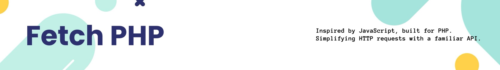

[](https://github.com/Thavarshan/fetch-php)

# About Fetch PHP

[](https://packagist.org/packages/jerome/fetch-php)
[](https://github.com/Thavarshan/fetch-php/actions/workflows/run-tests.yml)
[](https://github.com/Thavarshan/fetch-php/actions/workflows/laravel-pint.yml)
[](https://packagist.org/packages/jerome/fetch-php)

**FetchPHP** is a modern HTTP client library for PHP, built on top of the Guzzle HTTP client, designed to mimic the behavior of JavaScript’s `fetch` API. Leveraging **Matrix** for true asynchronous capabilities with PHP Fibers, FetchPHP allows developers to use a **JavaScript-like async/await** syntax. FetchPHP also offers a **fluent API** inspired by Laravel's HTTP client, making request building both flexible and readable.

Whether you're building small APIs or large-scale systems with high concurrency needs, FetchPHP provides a powerful and efficient solution for managing HTTP requests in PHP.

Make sure to check out [Matrix](https://github.com/Thavarshan/matrix) for more information on how FetchPHP is powered by PHP Fibers.

Full documentation can be found [here](https://fetch-php.thavarshan.com/)

---

### **Why Choose FetchPHP Over Guzzle?**

Guzzle is a well-established and widely-used HTTP client for PHP. It supports asynchronous requests using Promises. However, **FetchPHP** takes things further by offering **true asynchronous task management** through PHP Fibers, powered by **Matrix**. Here’s why FetchPHP stands out:

- **True Async Task Management with Fibers**: While Guzzle uses Promises for async operations, FetchPHP leverages PHP’s native Fibers (introduced in PHP 8.1) to provide **true non-blocking concurrency**. This gives developers **fine-grained control** over task execution, lifecycle management (e.g., pausing, resuming, retrying), and error handling.

- **JavaScript-Like `async`/`await` Syntax**: FetchPHP introduces a familiar `async()` syntax for developers who use JavaScript’s async/await functionality. This makes writing asynchronous PHP code more **readable** and **intuitive**.

- **Fluent API**: FetchPHP provides a **fluent, chainable API** similar to Laravel’s HTTP client, making constructing and managing HTTP requests easier. It’s more flexible and readable than Guzzle’s Promise-based API, which can feel rigid for managing complex tasks.

- **Error Handling and Task Lifecycle Control**: FetchPHP, powered by Matrix, allows for granular error management. Tasks can be paused, resumed, canceled, or retried dynamically, and errors can be handled through customizable handlers. Guzzle’s Promises manage errors in a less flexible way, usually through chained `.then()` and `.catch()` methods.

### **How FetchPHP's Async Task Management Differs from Guzzle**

Here’s a breakdown of FetchPHP’s underlying async task management powered by [Matrix](https://github.com/Thavarshan/matrix) compared to Guzzle’s Promise-based approach:

- **Fiber-Based Concurrency**: FetchPHP uses PHP Fibers to run tasks asynchronously. Fibers allow tasks to be paused, resumed, and canceled mid-execution, which isn’t possible with Guzzle’s Promises. This provides FetchPHP a true **multi-tasking** advantage.

- **Task Lifecycle Management**: FetchPHP allows you to start, pause, resume, cancel, and retry tasks using the `Task` class. Guzzle doesn’t offer built-in lifecycle management at this level. FetchPHP lets you track the status of a task (e.g., `PENDING`, `RUNNING`, `PAUSED`, `COMPLETED`, `FAILED`, `CANCELED`), giving more control over long-running or asynchronous processes.

- **Custom Error Handling**: FetchPHP offers a customizable `ErrorHandler` to manage retries, logging, and error resolution. This allows dynamic error handling and retrying tasks when needed, going beyond Guzzle’s Promises.

| Feature                | FetchPHP                                | Guzzle                                 |
|------------------------|-----------------------------------------|----------------------------------------|
| Async Task Management  | True async with PHP Fibers (PHP 8.1+)   | Promises-based concurrency             |
| JavaScript-like API    | `async/await` syntax                    | Traditional PHP-based Promises         |
| Task Lifecycle Control | Start, pause, resume, cancel, retry     | No built-in lifecycle management       |
| Error Handling         | Customizable error handlers             | Standard Promise error handling        |
| Concurrent Requests    | Supports Fibers for parallel tasks      | Limited to Promises and threading      |

---

> **Note**: The `fetch()` function allows for flexible HTTP request handling. When a URL is provided, it immediately sends the request. When no URL is provided, it returns a `ClientHandler` instance to enable further chaining for advanced request configuration.

#### **Example: Managing Asynchronous Tasks with FetchPHP**

```php
<?php

use Fetch\Interfaces\Response as ResponseInterface;

$data = null;

// Asynchronously send a POST request using async/await syntax
async(fn () => fetch('https://example.com', [
    'method' => 'POST',
    'headers' => ['Content-Type' => 'application/json'],
    'body' => json_encode(['key' => 'value']),
]))
    ->then(fn (ResponseInterface $response) => $data = $response->json())  // Success handler
    ->catch(fn (\Throwable $e) => echo "Error: " . $e->getMessage());      // Error handler

// The async operation is managed with start, pause, resume, and cancel controls
$task = async(fn () => fetch('https://example.com', [
    'method' => 'POST',
    'headers' => ['Content-Type' => 'application/json'],
    'body' => json_encode(['key' => 'value']),
]));

// Manually control the task lifecycle as `then` and `catch` will automatically start the task
$task->start();

// Pause the task if needed
$task->pause();

// Resume the task
$task->resume();

// Cancel the task if required
$task->cancel();

// Retry the task if it fails
if ($task->getStatus() === TaskStatus::FAILED) {
    $task->retry();
}

// Get the result only if the task is completed successfully
$result = $task->getResult();
```

---

#### **Lifecycle Control Example with FetchPHP**

```php
<?php

use Matrix\Task;
use Matrix\Enum\TaskStatus;

// Define a long-running task
$task = new Task(function () {
    return "Task completed!";
});

// Start the task
$task->start();

// Pause and resume the task dynamically
$task->pause();
$task->resume();

// Cancel the task if needed
$task->cancel();

// Retry the task if it fails
if ($task->getStatus() === TaskStatus::FAILED) {
    $task->retry();
}

$result = $task->getResult();
```

---

### **Why FetchPHP is Better for Asynchronous PHP**

While Guzzle is a fantastic tool for making HTTP requests, FetchPHP brings **modern PHP capabilities** with **PHP 8 Fibers**, making it ideal for developers who need **true asynchronous task management** with a **JavaScript-like syntax**. FetchPHP is designed to make your code more flexible, readable, and efficient when managing complex HTTP operations, especially when concurrency and non-blocking I/O are crucial.

---

## **Installation**

To install FetchPHP, run the following command:

```bash
composer require jerome/fetch-php
```

FetchPHP requires PHP 8.1 or above due to its use of Fibers for async tasks.

---

## **Core Features**

- **JavaScript-like fetch API** for HTTP requests (synchronous and asynchronous).
- **Fluent API** for building requests with a readable and chainable syntax.
- **Asynchronous support** with PHP Fibers via the Matrix package.
- **Built on Guzzle** for robust and reliable HTTP client functionality.

---

## **Usage Examples**

### **JavaScript-like Fetch API (Synchronous)**

```php
<?php

$response = fetch('https://example.com', [
    'method' => 'POST',
    'headers' => [
        'Content-Type' => 'application/json',
    ],
    'body' => json_encode(['key' => 'value']),
]);

$data = $response->json();
```

### **JavaScript-like Fetch API (Asynchronous)**

```php
<?php

use Fetch\Interfaces\Response as ResponseInterface;

$data = null;

// Asynchronously send a POST request using async/await syntax
async(fn () => fetch('https://example.com', [
    'method' => 'POST',
    'headers' => ['Content-Type' => 'application/json'],
    'body' => json_encode(['key' => 'value']),
]))
    ->then(fn (ResponseInterface $response) => $data = $response->json())  // Success handler
    ->catch(fn (\Throwable $e) => echo "Error: " . $e->getMessage());      // Error handler
```

---

### **Using the Fluent API**

FetchPHP’s fluent API provides the following methods for building requests:

- `withToken()`: Attach a Bearer token to the request.
- `withAuth()`: Attach basic authentication credentials.
- `withHeaders()`: Add headers to the request.
- `withBody()`: Add a request body (e.g., JSON, form data).
- `withProxy()`: Specify a proxy server for the request.
- `withCookies()`: Attach cookies to the request.
- `withQueryParameters()`: Add query parameters to the request URL.
- `timeout()`: Set the timeout for the request.
- `retry()`: Set the number of retries and delay for failed requests.

#### **Synchronous Example**

```php
<?php

$response = fetch()
    ->baseUri('https://example.com')
    ->withHeaders(['Content-Type' => 'application/json'])
    ->withBody(['key' => 'value'])
    ->withToken('fake-bearer-auth-token')
    ->post('/posts');

$data = $response->json();
```

#### **Asynchronous Example**

```php
<?php

use Fetch\Interfaces\Response as ResponseInterface;

$data = null;

// Asynchronously send a POST request using the fluent API
async(fn () => fetch()
    ->baseUri('https://example.com')
    ->withHeaders(['Content-Type' => 'application/json'])
    ->withBody(['key' => 'value'])
    ->withToken('fake-bearer-auth-token')
    ->post('/posts'))
    ->then(fn (ResponseInterface $response) => $data = $response->json())  // Success handler
    ->catch(fn (\Throwable $e) => echo "Error: " . $e->getMessage());      // Error handler
```

---

### **Using the ClientHandler Class**

The `ClientHandler` class is responsible for managing HTTP requests, including synchronous and asynchronous handling. You can use it directly for more advanced use cases:

#### **Basic Example with ClientHandler**

```php
<?php

use Fetch\Http\ClientHandler;

$response = ClientHandler::handle('GET', 'https://example.com', [
    'headers' => ['Accept' => 'application/json']
]);

$data = $response->json();
```

#### **Asynchronous Example with ClientHandler**

```php
<?php

use Fetch\Http\ClientHandler;

$data = null;

// Asynchronously manage a request using the ClientHandler
async(fn () => ClientHandler::handle('POST', 'https://example.com', [
    'headers' => ['Content-Type' => 'application/json'],
    'body' => json_encode(['key' => 'value']),
]))
    ->then(fn ($response) => $data = $response->json())
    ->catch(fn ($e) => echo "Error: " . $e->getMessage());
```

---

## **Request Options**

FetchPHP accepts an array of options to configure requests:

- **`method`**: HTTP method (e.g., `'GET'`, `'POST'`, etc.). Default is `'GET'`.
- **`headers`**: Array of HTTP headers.
- **`body`**: Request body for methods like POST, PUT, PATCH.
- **`json`**: JSON data to send as the request body.
- **`timeout`**: Timeout for the request in seconds.
- **`auth`**: Array for HTTP Basic or Digest authentication.
- **`proxy`**: Proxy server URL for routing requests.
- **`client`**: A custom Guzzle client instance.

---

### **Error Handling**

Both synchronous and asynchronous requests handle errors gracefully. Here's how you can manage errors:

#### **Synchronous Error Handling**

```php
<?php

$response = fetch('https://nonexistent-url.com');

if ($response->ok()) {
    echo $response->json();
} else {
    echo "Error: " . $response->statusText();
}
```

#### **Asynchronous Error Handling**

```php
<?php

$response = async(fn () => fetch('https://nonexistent-url.com'))
    ->then(fn ($response) => $response->json())
    ->catch(fn ($e) => echo "Error: " . $e->getMessage());

echo $response;
```

---

### **Advanced Error Handling: Retry with Exponential Backoff**

```php
<?php

$response = async(fn () => fetch('https://api.example.com/resource'))
    ->then(fn ($response) => $response->json())
    ->catch(function (\Throwable $e) {
        // Implement retry logic with exponential backoff
        static $attempt = 1;
        if ($attempt <= 3) {
            sleep(pow(2, $attempt));  // Exponential backoff
            $attempt++;
            return retryRequest();  // Custom function to retry
        }
        return "Error: " . $e->getMessage();
    });

echo $response;
```

---

## **Proxy and Authentication Support**

FetchPHP supports proxies and authentication out of the box:

### **Proxy Example**

```php
<?php

$response = fetch('https://example.com', [
    'proxy' => 'tcp://localhost:8080'
]);

// or

$response = fetch('https://example.com')
    ->withProxy('tcp://localhost:8080')
    ->get();

echo $response->statusText();
```

### **Authentication Example**

```php
<?php

$response = fetch('https://example.com/secure-endpoint', [
    'auth' => ['username', 'password']
]);

// or

$response = fetch('https://example.com')
    ->baseUri('https://example.com/')
    ->withAuth('username', 'password')
    ->get('/secure-endpoint');

echo $response->statusText();
```

---

## License

This project is licensed under the MIT License - see the [LICENSE.md](LICENSE.md) file for details.

---

## Contributing

Contributions are what make the open-source community such an amazing place to learn, inspire, and create. Any contributions you make are **greatly appreciated**.

We’re currently looking for help in the following areas:

- Expanding test coverage for async task management
- Improving documentation for more advanced use cases
- Adding support for additional HTTP methods and protocols

To contribute:

1. Fork the Project
2. Create your Feature Branch (`git checkout -b feature/amazing-feature`)
3. Commit your Changes (`git commit -m 'Add some amazing-feature'`)
4. Push to the Branch (`git push origin feature/amazing-feature`)
5. Open a Pull Request

---

## Authors

- **[Jerome Thayananthajothy]** - *Initial work* - [Thavarshan](https://github.com/Thavarshan)

See also the list of [contributors](https://github.com/Thavarshan/fetch-php/contributors) who participated in this project.

## Acknowledgments

- Thanks to **Guzzle HTTP** for providing the underlying HTTP client that powers synchronous requests.
